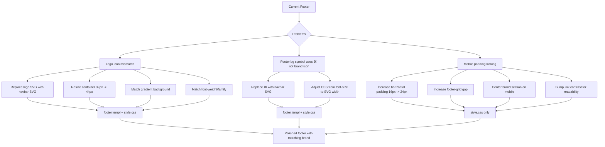

# Plan: Fix Footer Logo & Mobile Layout

## Overview

Three issues identified:

1. **Footer logo doesn't match navbar logo** — different SVG icon, different sizing, different styling.
2. **Footer background symbol (`⌘`) doesn't match brand identity** — should use the same brain/neural network SVG as the logo.
3. **Mobile footer lacks proper padding and feels unpolished** — horizontal padding is insufficient, spacing between sections feels cramped.

---

## Issue 1 — Footer Logo Mismatch

### Root Cause

The footer uses a **different SVG icon** and **different styling** from the navbar.

| Aspect | Navbar (`.navbar-icon`) | Footer (`.footer-logo-icon`) |
|--------|------------------------|------------------------------|
| SVG paths | Brain/neural network (many `path` + `circle` elements) | Different brain icon (fewer `path` elements) |
| Container size | `44x44px` | `32x32px` |
| Border radius | `12px` | `10px` |
| Background | `linear-gradient(135deg, #7C6FF0, #5B4FE0)` | `var(--accent)` → `#6366f1` (flat) |
| SVG size | `24x24` viewBox, `stroke="white"` | `18x18` viewBox, `stroke="currentColor"` |
| Text weight | `700` (Poppins) | `800` |
| Text color | `#1A1A2E` | `#FCF9F6` (white-ish) |
| Gap (icon→text) | `12px` | `10px` |

### Fix Steps

#### Step 1a — Replace footer SVG with navbar's SVG

In [`templ/components/footer.templ`](../templ/components/footer.templ:11) (lines 11-13), replace the footer's SVG `<path>` elements with the **exact same SVG** used in [`templ/components/navbar.templ`](../templ/components/navbar.templ:9) (lines 9-27). The correct SVG is the brain/neural-network icon (24x24 viewBox, 14 paths + 1 circle).

#### Step 1b — Match container sizing & styling

Update `.footer-logo-icon` CSS in [`assets/css/style.css`](../assets/css/style.css:1350):

- Change `width` / `height` from `32px` → **`44px`** (match navbar)
- Change `border-radius` from `10px` → **`12px`** (match navbar)
- Change `background` from `var(--accent)` → **`linear-gradient(135deg, #7C6FF0, #5B4FE0)`** (match navbar)
- Change SVG `width`/`height` attributes from `18` → **`24`** (match navbar)
- Ensure SVG uses `stroke="white"` not `stroke="currentColor"`

#### Step 1c — Match text styling

Update `.footer-logo` CSS in [`assets/css/style.css`](../assets/css/style.css:1336):
- Keep `color: #FCF9F6` (white on dark footer background is appropriate)
- Change `font-weight` from `800` → **`700`** (match navbar)
- Keep `font-size` as is (slightly larger on dark bg is fine)
- Add `font-family` matching navbar: `'Poppins', 'Nunito', system-ui, sans-serif`
- Change `gap` from `10px` → **`12px`** (match navbar)

#### Step 1d — Ensure `.footer-logo-icon` SVG uses correct stroke

Update the SVG attributes inside [`templ/components/footer.templ`](../templ/components/footer.templ:11):
- `stroke="white"` instead of `stroke="currentColor"`
- `stroke-width="1.5"` (navbar uses 1.5)
- Remove `width="18" height="18"` → replace with `width="24" height="24"`

#### Step 1e — Replace footer background symbol with navbar SVG icon

In [`templ/components/footer.templ`](../templ/components/footer.templ:5), replace the `⌘` text inside `.footer-bg-symbol` with the brain/neural network SVG from the navbar. This ensures the decorative background element also reflects the brand identity.

Changes needed:
- Remove `<div class="footer-bg-symbol" aria-hidden="true">⌘</div>`
- Replace with `<div class="footer-bg-symbol" aria-hidden="true">` containing the **same SVG** from the navbar (24x24 viewBox, brain icon), rendered at a large scale
- Since SVGs can't be easily scaled to `clamp(18rem, 35vw, 42rem)` via font-size, change the CSS approach: use `width` and `height` on the SVG element instead of font-size, or wrap the SVG inside the `.footer-bg-symbol` div and let it scale naturally

CSS adjustment in [`assets/css/style.css`](../assets/css/style.css:1304):
- Change `.footer-bg-symbol` from using `font-size` to using `width`/`height` on the SVG child
- Keep the same positioning, opacity (`rgba(255,255,255,0.025)`), and pointer-events: none
- The SVG should fill the container: set `width: clamp(18rem, 35vw, 42rem)` and `height: auto` with `viewBox="0 0 24 24" preserveAspectRatio="xMidYMid meet"`
- Remove `font-size`, `font-weight`, `font-family` since those are text-specific properties

---

## Issue 2 — Mobile Footer Padding & Polish

### Root Cause

On mobile (`max-width: 767px`), the footer relies on `.container` which provides `padding: 0 16px`. This is too narrow for a dark footer section, making content feel cramped against edges. The spacing between elements also gets compressed without clear visual hierarchy.

### Fix Steps

All changes in [`assets/css/style.css`](../assets/css/style.css), under the existing `@media (max-width: 767px)` block starting at line 1427.

#### Step 2a — Increase horizontal padding for footer on mobile

Add rule:
```css
.footer-inner {
  padding-left: var(--space-lg);  /* 24px */
  padding-right: var(--space-lg); /* 24px */
}
```
This gives breathing room beyond the `.container`'s 16px.

#### Step 2b — Improve visual spacing between brand section and link grid

Increase `gap` on `.footer-grid` from `var(--space-lg)` to `var(--space-xl)` so there's clear separation between the logo/tagline section and the link grid below it.

#### Step 2c — Make brand section more compact and centered

Adjust `.footer-brand`:
- Center-align text on mobile (text-align: center)
- Center the logo within the brand column (align-items: center)
- Keep tagline centered and at readable width

#### Step 2d — Refine link grid for compactness

Currently `.footer-links-grid` uses `grid-template-columns: 1fr 1fr`. This is good. But add:
- Slightly more vertical gap between items for better tap targets
- Ensure link text has enough contrast (currently `rgba(255,255,255,0.4)` — consider bumping to `0.55` on mobile for readability)

#### Step 2e — Add top padding refinement

On mobile, the `.footer-inner` padding-top is `var(--space-2xl)` (48px). This is appropriate but ensure the bottom padding is also comfortable at `var(--space-2xl)` (already set).

---

## Summary of files to modify

| File | Changes |
|------|---------|
| [`templ/components/footer.templ`](../templ/components/footer.templ) | Replace logo SVG with navbar's SVG; replace bg symbol `⌘` with navbar's SVG; update SVG attributes (width, height, stroke, stroke-width) |
| [`assets/css/style.css`](../assets/css/style.css) | Update `.footer-logo-icon` sizing/gradient; update `.footer-logo` font-weight/font-family; update `.footer-bg-symbol` to use SVG-based sizing; add mobile padding/spacing refinements |

---

## Mermaid Diagram: Visual Change Flow



---

## Execution Order

1. Edit [`templ/components/footer.templ`](../templ/components/footer.templ):
   - Replace logo SVG with navbar's brain/neural network SVG
   - Replace footer background symbol `⌘` with same SVG
   - Update SVG attributes (width, height, stroke, stroke-width)
2. Edit [`assets/css/style.css`](../assets/css/style.css):
   - Update `.footer-logo-icon` sizing/gradient/radius
   - Update `.footer-logo` font-weight/font-family/gap
   - Update `.footer-bg-symbol` from text-based to SVG-based sizing
   - Add mobile responsive rules for padding/spacing/contrast
3. Run `templ generate` to regenerate [`templ/components/footer_templ.go`](../templ/components/footer_templ.go)
4. Verify the project builds successfully with `go build ./...` or similar
