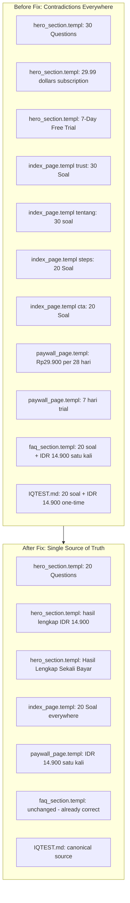

# Index Page P0 Fix Plan — Content Contradictions, AI-Slop Patterns & Color Unification

> **Target**: `templ/pages/index_page.templ` + related component files  
> **Canonical Source of Truth**: [`IQTEST.md`](context/IQTEST.md) §2.4, §1.1  
> **Design Reference**: [`DESIGN.md`](context/DESIGN.md)  
> **Date**: 2026-07-30

---

## Phase 1: P0 Content Contradictions

### Canonical Values (from IQTEST.md)

| Attribute | Value | Source |
|-----------|-------|--------|
| Quiz length | **20 questions** | IQTEST.md §2.4, §3.3, §4.5 |
| Pricing model | **One-time IDR 14.900** (freemium) | IQTEST.md §1.1 |
| Max raw score | **30.5** | IQTEST.md §3.3, §6.2 |
| Time per question | **2 minutes** | IQTEST.md §2.4 |
| Total duration | **±40 minutes** | IQTEST.md §2.4 |

### Fix 1.1: Hero Section — "30 Questions" → "20 Questions"

**File**: [`templ/components/hero_section.templ`](templ/components/hero_section.templ:60)

```diff
- <span class="hero-feature-text">30 Questions</span>
+ <span class="hero-feature-text">20 Questions</span>
```

### Fix 1.2: Hero Section — Remove subscription disclaimer

**File**: [`templ/components/hero_section.templ`](templ/components/hero_section.templ:89-96)

The hero disclaimer currently reads:

```
After trial, $29.99 billed every 28 days • Cancel anytime
```

This is a subscription model. Per IQTEST.md §1.1, the product uses one-time IDR 14.900 freemium. Replace the entire `.hero-disclaimer` block with freemium-consistent messaging:

```diff
- <div class="hero-disclaimer">
-     <svg>...</svg>
-     <span>After trial, $29.99 billed every 28 days • Cancel anytime</span>
- </div>
+ <div class="hero-disclaimer">
+     <svg width="20" height="20" viewBox="0 0 20 20" fill="none" xmlns="http://www.w3.org/2000/svg">
+         <path d="M10 2 L17 5v5c0 4.5-3 7.5-7 8-4-0.5-7-3.5-7-8V5l7-3Z" stroke="#5B6EF5" stroke-width="1.5"/>
+         <path d="M7 10l2 2 4-4" stroke="#5B6EF5" stroke-width="1.5" stroke-linecap="round" stroke-linejoin="round"/>
+     </svg>
+     <span>Gratis selamanya · Hasil lengkap cukup IDR 14.900</span>
+ </div>
```

### Fix 1.3: Hero Section — "7-Day Free Trial IQ Booster" → Remove/substitute

**File**: [`templ/components/hero_section.templ`](templ/components/hero_section.templ:79-86)

This feature promotes a trial + subscription model that doesn't exist. Replace with a feature that matches the freemium model:

```diff
- <div class="hero-feature">
-     <div class="hero-feature-icon" style="background:#DBEAFE;">
-         <svg>...</svg>
-     </div>
-     <span class="hero-feature-text">7-Day Free Trial IQ Booster</span>
- </div>
+ <div class="hero-feature">
+     <div class="hero-feature-icon" style="background:#DBEAFE;">
+         <svg width="24" height="24" viewBox="0 0 24 24" fill="none" xmlns="http://www.w3.org/2000/svg">
+             <path d="M12 2L2 7l10 5 10-5-10-5z" stroke="#2563EB" stroke-width="1.8" stroke-linejoin="round"/>
+             <path d="M2 17l10 5 10-5" stroke="#2563EB" stroke-width="1.8" stroke-linejoin="round"/>
+             <path d="M2 12l10 5 10-5" stroke="#2563EB" stroke-width="1.8" stroke-linejoin="round"/>
+         </svg>
+     </div>
+     <span class="hero-feature-text">Hasil Lengkap Sekali Bayar</span>
+ </div>
```

### Fix 1.4: Trust Bar — "30" → "20"

**File**: [`templ/pages/index_page.templ`](templ/pages/index_page.templ:24)

```diff
- <div class="trust-number">30</div>
- <div class="trust-label">Soal Bergambar</div>
+ <div class="trust-number">20</div>
+ <div class="trust-label">Soal Bergambar</div>
```

### Fix 1.5: "Tentang Tes" section — "30 soal" → "20 soal"

**File**: [`templ/pages/index_page.templ`](templ/pages/index_page.templ:85)

```diff
- <p>...Dengan 30 soal yang mencakup 4 domain kognitif berbeda...
+ <p>...Dengan 20 soal yang mencakup 4 domain kognitif berbeda...
```

### Fix 1.6: Paywall Agreement — Subscription → One-time

**File**: [`templ/pages/paywall_page.templ`](templ/pages/paywall_page.templ:171)

```diff
- <span>Saya menyetujui <a href="/page/syarat-ketentuan" target="_blank">Syarat & Ketentuan</a> dan <a href="/page/kebijakan-privasi" target="_blank">Kebijakan Privasi</a>. Setelah masa trial 7 hari, langganan akan berlanjut otomatis sebesar <strong>Rp29.900 setiap 28 hari</strong> kecuali dibatalkan.</span>
+ <span>Saya menyetujui <a href="/page/syarat-ketentuan" target="_blank">Syarat & Ketentuan</a> dan <a href="/page/kebijakan-privasi" target="_blank">Kebijakan Privasi</a>. Pembayaran satu kali sebesar <strong>IDR 14.900</strong> untuk membuka hasil lengkap selamanya.</span>
```

### Fix 1.7: Paywall Review — Remove trial reference

**File**: [`templ/pages/paywall_page.templ`](templ/pages/paywall_page.templ:259)

```diff
- <p>"IQ Boosternya bikin penasaran — 7 hari trial ternyata cukup buat liat perkembangan. Overall worth it banget!"</p>
+ <p>"IQ Boosternya bikin penasaran — hasil per domain bantu banget paham kekuatan dan kelemahan kognitif. Overall worth it banget!"</p>
```

---

## Phase 2: AI-Slop Structural Pattern Elimination

### Problem Summary

`index_page.templ` contains three banned patterns from the Impeccable skill:

1. **Hero-metric template**: Trust bar (lines 18-35) — big numbers + small labels
2. **Identical card grid**: 6 feature cards (lines 46-71) — all icon→heading→text
3. **Numbered section markers as default scaffolding**: Steps 01/02/03 (lines 96-98)

### Fix 2.1: Replace Trust Bar with Single Compelling Stat + Social Proof

**File**: [`templ/pages/index_page.templ`](templ/pages/index_page.templ:17-37)

Replace the 4-item metric bar with a single testimonial-style trust statement:

```templ
<!-- TRUST SIGNAL -->
<section class="section" aria-labelledby="trust-heading">
    <div class="container">
        <div class="trust-signal fade-in-up">
            <p class="trust-quote">"Dirancang berdasarkan Classical Test Theory — 20 soal bergambar yang mengukur 4 domain kognitif dengan bobot kesulitan terkalibrasi."</p>
            <div class="trust-pills">
                <span class="trust-pill"><span class="check-icon">✓</span> 20 Soal Bergambar</span>
                <span class="trust-pill"><span class="check-icon">✓</span> 4 Domain Kognitif</span>
                <span class="trust-pill"><span class="check-icon">✓</span> Hasil Lengkap Rp14.900</span>
            </div>
        </div>
    </div>
</section>
```

This replaces the "big number + small label" template with a statement + inline benefit pills. The trust bar CSS (`.trust-bar`, `.trust-item`, `.trust-number`, `.trust-label`) would be replaced in [`style.css`](assets/css/style.css) with:

```css
.trust-signal {
    text-align: center;
    max-width: var(--measure-body);
    margin: 0 auto;
    padding: var(--space-xl) 0;
}
.trust-quote {
    font-size: var(--text-lg);
    color: var(--inkMuted);
    line-height: var(--leading-relaxed);
    margin-bottom: var(--space-lg);
}
.trust-pills {
    display: flex;
    flex-wrap: wrap;
    justify-content: center;
    gap: var(--space-sm);
}
.trust-pill {
    display: inline-flex;
    align-items: center;
    gap: 6px;
    padding: 6px 14px;
    background: var(--accentLight);
    color: var(--ink);
    border-radius: 999px;
    font-size: var(--text-sm);
    font-weight: 500;
}
.trust-pill .check-icon {
    color: var(--accent);
    font-weight: 700;
}
```

### Fix 2.2: Differentiate Feature Cards — Reduce from 6 Identical to 3 Varied + 3 Alternate

**File**: [`templ/pages/index_page.templ`](templ/pages/index_page.templ:46-71)

Instead of 6 identical icon→heading→text cards, use 3 primary cards with a different visual format for the other 3 points:

```templ
<div class="features-grid" style="margin-top:48px;">
    <!-- Primary cards (3) -->
    <div class="feature-card feature-card--primary fade-in-up" style="animation-delay:0.05s;">
        <div class="feature-icon">...</div>
        <h3>Berbasis Ilmiah</h3>
        <p>Dikembangkan berdasarkan Classical Test Theory (CTT) dengan kalibrasi kesulitan item, selaras dengan tes Raven's Progressive Matrices.</p>
    </div>
    <div class="feature-card feature-card--primary fade-in-up" style="animation-delay:0.1s;">
        <div class="feature-icon">...</div>
        <h3>Non-Verbal & Bebas Bias</h3>
        <p>Semua soal bergambar, meminimalkan bias bahasa dan budaya. Cocok untuk mengukur fluid intelligence murni.</p>
    </div>
    <div class="feature-card feature-card--primary fade-in-up" style="animation-delay:0.15s;">
        <div class="feature-icon">...</div>
        <h3>4 Domain Kognitif</h3>
        <p>Penalaran Matriks, Deret Logis, Rotasi Spasial, dan Analogi Visual — mencakup spektrum kognitif luas.</p>
    </div>

    <!-- Secondary features (horizontal strip, not cards) -->
    <div class="feature-strip fade-in-up" style="animation-delay:0.2s; grid-column: 1 / -1;">
        <div class="feature-strip-item">
            <span class="feature-strip-icon">⏱</span>
            <span>2 menit per soal · Anti-Cheat · Auto-advance</span>
        </div>
        <div class="feature-strip-item">
            <span class="feature-strip-icon">⚖️</span>
            <span>Bobot kesulitan bertingkat · Skor maks 30.5</span>
        </div>
        <div class="feature-strip-item">
            <span class="feature-strip-icon">💳</span>
            <span>Gratis selamanya · Hasil lengkap IDR 14.900 sekali bayar</span>
        </div>
    </div>
</div>
```

Add CSS for the feature strip in [`style.css`](assets/css/style.css):

```css
.feature-strip {
    display: flex;
    flex-wrap: wrap;
    gap: var(--space-lg);
    padding: var(--space-lg) var(--space-xl);
    background: var(--surface);
    border: 1px solid var(--bordLight);
    border-radius: var(--radiusCard);
    margin-top: var(--space-lg);
}
.feature-strip-item {
    display: flex;
    align-items: center;
    gap: var(--space-sm);
    font-size: var(--text-sm);
    color: var(--inkMuted);
    flex: 1 1 240px;
}
.feature-strip-icon {
    font-size: 1.25rem;
    flex-shrink: 0;
}
```

Also update the features grid to 3 columns (instead of 3×2):

```css
.features-grid {
    display: grid;
    grid-template-columns: repeat(3, 1fr);
    gap: var(--space-lg);
}
```

### Fix 2.3: Keep Numbered Steps but De-template Them

The steps ARE genuinely sequential (a real 3-step process), so numbers are justified here. But make them visually distinct from the generic template by:

1. Adding a subtle timeline visual instead of the generic connecting line
2. Making the step numbers smaller and integrated into the card rather than giant decorative numbers

**File**: [`templ/pages/index_page.templ`](templ/pages/index_page.templ:95-99)

Replace step number (01/02/03 giant decorative numbers) with a compact timeline indicator:

```templ
<div class="steps-container">
    <div class="step-card fade-in-up" style="animation-delay:0.1s;">
        <div class="step-marker"><span aria-hidden="true">1</span></div>
        <h3>Mulai Tes</h3>
        <p>Klik tombol "Mulai Tes Gratis", isi nama dan email, lalu kamu akan langsung diarahkan ke halaman tes.</p>
        <code class="step-code">/quiz</code>
    </div>
    <div class="step-card fade-in-up" style="animation-delay:0.2s;">
        <div class="step-marker"><span aria-hidden="true">2</span></div>
        <h3>Jawab 20 Soal</h3>
        <p>Setiap soal bergambar dengan 4 opsi A/B/C/D. Kamu punya 2 menit per soal. Jawaban terkunci setelah dipilih.</p>
        <code class="step-code">±40 menit</code>
    </div>
    <div class="step-card fade-in-up" style="animation-delay:0.3s;">
        <div class="step-marker"><span aria-hidden="true">3</span></div>
        <h3>Dapatkan Hasil</h3>
        <p>Terima skor mentah, persentil, breakdown per domain, dan analisis kekuatan kognitif setelah pembayaran.</p>
        <code class="step-code">Rp14.900</code>
    </div>
</div>
```

Update CSS in [`style.css`](assets/css/style.css) — replace `.step-number` with `.step-marker`:

```css
/* Replace .step-number with .step-marker */
.step-marker {
    width: 36px;
    height: 36px;
    border-radius: 50%;
    background: var(--accent);
    color: white;
    display: flex;
    align-items: center;
    justify-content: center;
    font-size: var(--text-sm);
    font-weight: 700;
    margin: 0 auto var(--space-sm);
}
.step-marker span {
    line-height: 1;
}
```

Remove the `::before` connecting line or replace with a more subtle timeline:

```css
.steps-container::before {
    /* replaced with vertical timeline on mobile */
    display: none;
}
```

---

## Phase 3: Hero Color System Unification

### Problem

The hero section uses its own color palette (`#4A5CF5`, `#5B6EF5`, `#6C5CE7`, `#F5A623`, `#FB923C`) that diverges from the main design system's `--accent: #6366f1`. DESIGN.md §1.5 acknowledges this as a separate system. The transition from hero (blue/purple gradient) to rest-of-page (indigo) creates a jarring two-brand experience.

### Fix 3.1: Map Hero Colors to Design Tokens in hero.css

**File**: [`assets/css/hero.css`](assets/css/hero.css)

The most surgical approach: define hero-specific CSS variables that inherit from the main design tokens where possible, and keep only the genuinely distinct hero colors scoped to `.hero-wrapper`:

```css
.hero-wrapper {
    /* Brand colors — scoped to hero context only */
    --hero-accent: var(--accent);           /* #6366f1 — align with main system */
    --hero-accent-hover: var(--accentHover); /* #4f46e5 */
    --hero-accent-purple: #6C5CE7;          /* keep distinct — gradient partner */
    --hero-accent-yellow: #F5A623;          /* keep distinct — sparkle only */
    --hero-text-dark: var(--ink);           /* #0f172a */
    --hero-text-secondary: var(--inkMuted); /* #475569 */
    
    /* Pastels for feature icon backgrounds */
    --pastel-purple: #EDE9FE;
    --pastel-green: #DCFCE7;
    --pastel-orange: #FEF3C7;
    --pastel-blue: #DBEAFE;
}
```

Then update hardcoded hex values in hero CSS to reference these scoped variables:

| Old Hardcoded Value | Replace With |
|---------------------|-------------|
| `#5B6EF5` (CTA gradient start, "Next Question" button) | `var(--hero-accent)` |
| `#4A5CF5` (headline highlight) | `var(--hero-accent)` |
| `#6C5CE7` (CTA gradient end) | `var(--hero-accent-purple)` |
| `#F5A623` (sparkle) | `var(--hero-accent-yellow)` |
| `#111827` (headline text) | `var(--hero-text-dark)` |
| `#4B5563` (subheadline) | `var(--hero-text-secondary)` |

This keeps the hero's visual identity (gradient CTA, purple accent partner, yellow sparkles) while anchoring its core accent to the main `--accent: #6366f1` token, removing the two-system split.

### Fix 3.2: Update Hero Badge & Feature Icon Colors

**File**: [`templ/components/hero_section.templ`](templ/components/hero_section.templ:L13-L86)

Current hardcoded hex values in hero templ:
- Badge SVG: `#EDEBFB`, `#6C5CE7` → keep (decorative)
- Feature icon backgrounds: `#EDE9FE`, `#DCFCE7`, `#FEF3C7`, `#DBEAFE` → keep (pastels are fine)
- Feature icon strokes: `#7C3AED`, `#16A34A`, `#F59E0B`, `#2563EB` → keep (these are the icon-specific accent colors, not the main brand accent)
- CTA button SVG circle fill: `#FFFFFF`, arrow stroke: `#5B6EF5` → change `#5B6EF5` to `#6366f1` (main accent)

---

## Phase 4: Minor Fixes from Critique

### Fix 4.1: CTA Button Radius Consistency

The navbar CTA uses `border-radius: 10px`, the standard `.cta-btn` uses `--radiusBtn` (8px), and the hero CTA uses `border-radius: 999px` (pill). Standardize on `--radiusBtn` (8px) for all CTAs except the hero (pill is acceptable there as a hero-specific treatment).

**File**: [`assets/css/style.css`](assets/css/style.css:282)

```diff
- border-radius: 10px;
+ border-radius: var(--radiusBtn);
```

### Fix 4.2: Add `text-wrap: balance` to `.section-heading p`

**File**: [`assets/css/style.css`](assets/css/style.css:449-453)

```diff
.section-heading p {
    font-size: var(--text-base);
    color: var(--inkMuted);
    line-height: var(--leading-normal);
+   text-wrap: balance;
}
```

---

## File Change Summary

| # | File | Change Type | Phase |
|---|------|-------------|-------|
| 1 | `templ/components/hero_section.templ` | Edit: "30 Questions" → "20 Questions" | 1 |
| 2 | `templ/components/hero_section.templ` | Edit: Replace subscription disclaimer | 1 |
| 3 | `templ/components/hero_section.templ` | Edit: Replace "7-Day Free Trial" feature | 1 |
| 4 | `templ/pages/index_page.templ` | Edit: Trust bar "30" → "20" | 1 |
| 5 | `templ/pages/index_page.templ` | Edit: "30 soal" → "20 soal" | 1 |
| 6 | `templ/pages/paywall_page.templ` | Edit: Subscription text → one-time | 1 |
| 7 | `templ/pages/paywall_page.templ` | Edit: Remove trial reference in review | 1 |
| 8 | `templ/pages/index_page.templ` | Edit: Replace trust bar with trust signal | 2 |
| 9 | `assets/css/style.css` | Edit: Replace trust bar CSS → trust signal CSS | 2 |
| 10 | `templ/pages/index_page.templ` | Edit: 6 identical cards → 3 cards + strip | 2 |
| 11 | `assets/css/style.css` | Edit: Add feature strip CSS, update grid | 2 |
| 12 | `templ/pages/index_page.templ` | Edit: Replace giant step numbers with markers | 2 |
| 13 | `assets/css/style.css` | Edit: Replace .step-number → .step-marker CSS | 2 |
| 14 | `assets/css/hero.css` | Edit: Map hero colors to design tokens | 3 |
| 15 | `assets/css/style.css` | Edit: Navbar CTA radius → `--radiusBtn` | 4 |
| 16 | `assets/css/style.css` | Edit: Add `text-wrap: balance` to section heading p | 4 |

---

## Execution Order

1. **Phase 1 first** (P0): Fix content contradictions — these are correctness bugs, not design opinions
2. **Phase 3 second**: Unify hero colors — this aligns the visual system without structural changes
3. **Phase 2 third**: Eliminate AI-slop patterns — these are structural changes that touch the most CSS
4. **Phase 4 last**: Minor polish items

After all phases: run `templ generate` to regenerate `*_templ.go` files, then verify the build.

---

## Mermaid Flow: Before/After Content Consistency


