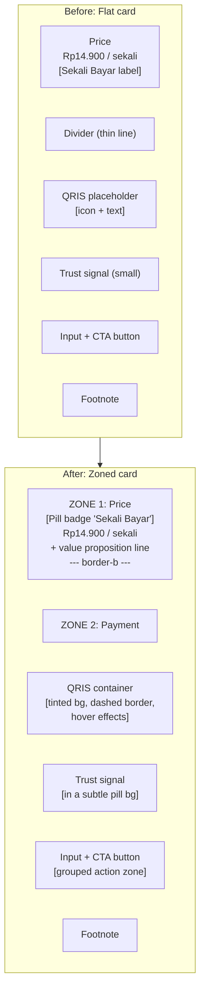

# Plan: Refactor Payment Card — Paywall Page

## Current Issues

The payment card (lines 80-121 of [`templ/pages/paywall_page.templ`](templ/pages/paywall_page.templ:80)) currently feels generic / non-premium due to:

1. **Flat hierarchy** — price, QRIS, input, and button all live in one undifferentiated card with only a thin `.divider` separating price from payment
2. **"Sekali Bayar" label** uses the exact `tracking-wider uppercase` eyebrow pattern that the skill bans — looks like a 2023 SaaS template
3. **QRIS placeholder is weak** — a plain white box with a generic QR code icon SVG and "Scan QRIS" text; no visual interest or premium cue
4. **Trust signal is buried** — tiny lock icon + even smaller text floating between QRIS and input, easy to miss
5. **Input field and CTA** are stacked without clear grouping, making the action zone feel cramped
6. **No value proposition** under the price — the user sees a price but no reminder of *what* they're buying

## Proposed Solution

Split the card into **two visually distinct zones** with a refined `border-b` separator, then elevate each zone's craftsmanship.

### Zone 1: Price Header (top)

| Before | After |
|--------|-------|
| `tracking-wider uppercase` eyebrow "SEKALI BAYAR" | Pill badge with star icon + "Sekali Bayar" — warm, inviting |
| Price `Rp14.900` + `/ sekali` in plain text | Same price, but add a one-line value prop under it: *"Akses penuh hasil tes — skor lengkap, analisis per domain, dan gambaran kemampuan kognitif."* |
| Plain divider | `border-b border-[var(--bordLight)]` on the price zone itself |

### Zone 2: Payment Action (bottom)

| Aspect | Change |
|--------|--------|
| **QRIS container** | Add subtle `var(--accentLight)` tinted background; replace plain border with `border-2 border-dashed` on the QR placeholder box for a "real QR card" feel; add hover transition |
| **QRIS label** | Restructure: "Scan QRIS" heading + "Gunakan aplikasi mobile banking atau e-wallet" sub-text |
| **Trust signal** | Wrap in a subtle pill (`bg-[var(--bgSection)]` rounded-full) to make it feel intentional, not an afterthought |
| **Input + CTA** | Keep `space-y-3` but add a `relative` wrapper on the input for potential focus-ring enhancement |
| **Footnote** | Keep but ensure consistent `text-[var(--inkSubtle)]` |

### Visual enhancements across the card

- Add `overflow-hidden` on the card so the border-radius clips any decorative elements cleanly
- Use the existing design tokens (`--accentLight`, `--bgSection`, `--inkMuted`, etc.) — no new color variables
- Retain `fade-in-up` animation and staggered delays

## CSS Changes

Minimal. The paywall already uses existing utility classes and tokens. Only need:

1. **Remove** the standalone `.divider` class usage (lines 32-38 of [`assets/css/paywall.css`](assets/css/paywall.css:32)) — replaced by `border-b` on the price zone directly
   - Keep the `.divider` class definition in CSS for backward compatibility (other pages might use it)
2. **No new CSS tokens needed** — everything uses existing `--accentLight`, `--bgSection`, `--inkMuted`, `--inkSubtle`, `--bordLight`, `--accent` variables

## Files to Modify

| File | Lines | Change |
|------|-------|--------|
| [`templ/pages/paywall_page.templ`](templ/pages/paywall_page.templ:80) | 80-121 | Restructure payment card markup (see diff below) |
| [`assets/css/paywall.css`](assets/css/paywall.css) | — | No changes needed; `.divider` class kept as-is for stability |

## Detailed Diff (templ)

```
<<<<<<< SEARCH
			<!-- Card pembayaran — clear hierarchy -->
			<div class="card card-elevated text-center fade-in-up transition-all duration-300 hover:shadow-xl" style="animation-delay:0.2s;">
				<!-- Harga — clean, price-first -->
				<div class="px-8 pt-8 pb-6">
					<p class="text-[11px] font-medium text-[var(--textSubtle)] mb-2 m-0 tracking-wider uppercase">Sekali Bayar</p>
					<div class="flex items-baseline justify-center gap-1.5">
						<span class="text-4xl font-bold text-[var(--textMain)]">Rp14.900</span>
						<span class="text-xs text-[var(--textSubtle)] font-medium">/ sekali</span>
					</div>
				</div>

				<!-- Divider -->
				<div class="divider"></div>

				<!-- QRIS + Aksi -->
				<div class="px-8 pb-8 pt-6">
					<div class="mb-6 p-6 rounded-xl bg-[var(--surface)] border border-[var(--bordLight)] transition-all duration-300 hover:shadow-sm">
						<div class="w-48 h-48 mx-auto rounded-xl bg-white flex items-center justify-center border border-[var(--bordLight)]">
							<div class="text-center">
								<svg xmlns="http://www.w3.org/2000/svg" width="48" height="48" viewBox="0 0 24 24" fill="none" stroke="currentColor" stroke-width="1.5" stroke-linecap="round" stroke-linejoin="round" class="text-[var(--textSubtle)]"><path d="M3 7V5a2 2 0 0 1 2-2h2"/><path d="M17 3h2a2 2 0 0 1 2 2v2"/><path d="M21 17v2a2 2 0 0 1-2 2h-2"/><path d="M7 21H5a2 2 0 0 1-2-2v-2"/><rect x="7" y="7" width="10" height="10" rx="2"/></svg>
								<p class="text-xs text-[var(--textSubtle)] mt-2 m-0">Scan QRIS</p>
							</div>
						</div>
						<p class="text-xs text-[var(--textMuted)] mt-3 m-0">Scan QR code di atas menggunakan aplikasi mobile banking atau e-wallet.</p>
					</div>

					<!-- Trust signal -->
					<div class="flex items-center justify-center gap-1.5 mb-5">
						<svg xmlns="http://www.w3.org/2000/svg" width="14" height="14" viewBox="0 0 24 24" fill="none" stroke="currentColor" stroke-width="2" stroke-linecap="round" stroke-linejoin="round" class="text-[var(--textSubtle)]"><rect x="3" y="11" width="18" height="11" rx="2" ry="2"/><path d="M7 11V7a5 5 0 0 1 10 0v4"/></svg>
						<span class="text-xs text-[var(--textSubtle)]">Pembayaran aman & terenkripsi</span>
					</div>

					<div class="space-y-3">
						<input type="text" id="namaPengirim" placeholder="Nama pengirim transfer" class="input-field transition-all duration-200"/>
						<button data-paywall-id={ data.ID } onclick="konfirmasiBayar(this)" class="btn-primary w-full btn-paywall-cta transition-all duration-300">
							<svg xmlns="http://www.w3.org/2000/svg" width="18" height="18" viewBox="0 0 24 24" fill="none" stroke="currentColor" stroke-width="2.5" stroke-linecap="round" stroke-linejoin="round"><path d="M22 11.08V12a10 10 0 1 1-5.93-9.14"/><polyline points="22 4 12 14.01 9 11.01"/></svg>
							Saya Sudah Bayar
						</button>
					</div>
					<p class="text-xs text-[var(--textSubtle)] mt-4 m-0 leading-relaxed">Hasil akan langsung bisa diakses setelah pembayaran terverifikasi.</p>
				</div>
			</div>
=======
			<!-- Card pembayaran — refined hierarchy: price zone + payment zone -->
			<div class="card card-elevated overflow-hidden text-center fade-in-up transition-all duration-300 hover:shadow-xl" style="animation-delay:0.2s;">

				<!-- ZONE 1: Price — clean, price-first, with value proposition -->
				<div class="px-8 pt-8 pb-6 border-b border-[var(--bordLight)]">
					<div class="flex items-center justify-center gap-2 mb-3">
						<span class="inline-flex items-center gap-1.5 px-3 py-1 rounded-full text-xs font-medium bg-[var(--accentLight)] text-[var(--accent)]">
							<svg xmlns="http://www.w3.org/2000/svg" width="12" height="12" viewBox="0 0 24 24" fill="none" stroke="currentColor" stroke-width="2.5" stroke-linecap="round" stroke-linejoin="round"><polygon points="12 2 15.09 8.26 22 9.27 17 14.14 18.18 21.02 12 17.77 5.82 21.02 7 14.14 2 9.27 8.91 8.26 12 2"/></svg>
							Sekali Bayar
						</span>
					</div>
					<div class="flex items-baseline justify-center gap-1.5">
						<span class="text-[2.5rem] md:text-5xl font-bold tracking-tight text-[var(--textMain)] leading-none">Rp14.900</span>
						<span class="text-sm text-[var(--textSubtle)] font-medium">/ sekali</span>
					</div>
					<p class="text-sm text-[var(--textMuted)] mt-3 m-0 max-w-[36ch] mx-auto leading-snug">
						Akses penuh hasil tes — skor lengkap, analisis per domain, dan gambaran kemampuan kognitif.
					</p>
				</div>

				<!-- ZONE 2: Payment action — QRIS + trust + input + CTA -->
				<div class="px-8 pb-8 pt-6">
					<!-- QRIS container — premium treatment -->
					<div class="mb-6 p-6 rounded-xl bg-[var(--accentLight)]/40 border border-[var(--bordLight)] transition-all duration-300 hover:border-[var(--accent)]/20 hover:shadow-sm">
						<div class="w-44 h-44 mx-auto rounded-xl bg-white flex items-center justify-center border-2 border-dashed border-[var(--bordLight)] shadow-sm transition-colors duration-300">
							<div class="text-center">
								<svg xmlns="http://www.w3.org/2000/svg" width="44" height="44" viewBox="0 0 24 24" fill="none" stroke="currentColor" stroke-width="1.5" stroke-linecap="round" stroke-linejoin="round" class="text-[var(--textSubtle)]"><path d="M3 7V5a2 2 0 0 1 2-2h2"/><path d="M17 3h2a2 2 0 0 1 2 2v2"/><path d="M21 17v2a2 2 0 0 1-2 2h-2"/><path d="M7 21H5a2 2 0 0 1-2-2v-2"/><rect x="7" y="7" width="10" height="10" rx="2"/></svg>
								<p class="text-xs font-medium text-[var(--textSubtle)] mt-3 m-0">QRIS</p>
							</div>
						</div>
						<div class="text-center mt-4">
							<p class="text-sm font-semibold text-[var(--textMain)] m-0">Scan QRIS</p>
							<p class="text-xs text-[var(--textMuted)] mt-1 m-0">Gunakan aplikasi mobile banking atau e-wallet favoritmu.</p>
						</div>
					</div>

					<!-- Trust signal — enhanced -->
					<div class="flex items-center justify-center mb-5">
						<span class="inline-flex items-center gap-1.5 px-3 py-1.5 rounded-full bg-[var(--bgSection)]">
							<svg xmlns="http://www.w3.org/2000/svg" width="13" height="13" viewBox="0 0 24 24" fill="none" stroke="currentColor" stroke-width="2" stroke-linecap="round" stroke-linejoin="round" class="text-[var(--textSubtle)]"><rect x="3" y="11" width="18" height="11" rx="2" ry="2"/><path d="M7 11V7a5 5 0 0 1 10 0v4"/></svg>
							<span class="text-xs text-[var(--textSubtle)]">Pembayaran aman & terenkripsi</span>
						</span>
					</div>

					<!-- Action zone: input + CTA -->
					<div class="space-y-3">
						<input type="text" id="namaPengirim" placeholder="Nama pengirim transfer" class="input-field transition-all duration-200"/>
						<button data-paywall-id={ data.ID } onclick="konfirmasiBayar(this)" class="btn-primary w-full btn-paywall-cta transition-all duration-300">
							<svg xmlns="http://www.w3.org/2000/svg" width="18" height="18" viewBox="0 0 24 24" fill="none" stroke="currentColor" stroke-width="2.5" stroke-linecap="round" stroke-linejoin="round"><path d="M22 11.08V12a10 10 0 1 1-5.93-9.14"/><polyline points="22 4 12 14.01 9 11.01"/></svg>
							Saya Sudah Bayar
						</button>
					</div>
					<p class="text-xs text-[var(--textSubtle)] mt-4 m-0 leading-relaxed">Hasil akan langsung bisa diakses setelah pembayaran terverifikasi.</p>
				</div>

			</div>
>>>>>>> REPLACE
```

## Visual Summary (Mermaid)



## Execution Steps (for Code mode)

1. Open [`templ/pages/paywall_page.templ`](templ/pages/paywall_page.templ:80)
2. Replace lines 80-121 (the payment card block) with the new markup shown above
3. **Do NOT** edit `assets/css/paywall.css` (`.divider` class stays for stability)
4. Run `templ generate` in the project root to regenerate `*_templ.go`
5. Run `go build ./...` to verify the build succeeds

## Constraints / Rules

- **Do not change** the JS function `konfirmasiBayar`, element IDs (`namaPengirim`, `data-paywall-id`), or any data attributes
- **Do not edit** `*_templ.go` files (generated) — always run `templ generate` after `.templ` changes
- **Do not add** new design tokens or hardcoded hex colors — use existing `var(--token)` references
- **Do not change** the container max-width (`640px`), section layout, or any other part of the page outside the payment card
