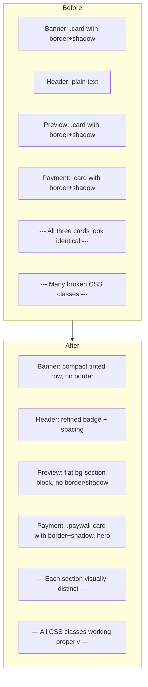

# Plan: Paywall Page Refactor — Layout, Spacing & UI Hierarchy

> Fokus: Layout, padding, margin, gap, visual hierarchy, UI refinement.
> Background tetap pakai `bg-gradient-paywall` (yang sekarang mapping ke `var(--bg)`).
> Semua CSS baru masuk ke `paywall.css`, bukan `style.css`.

---

## 0. Prinsip Desain

| Prinsip | Penerapan |
|---------|-----------|
| **Hierarki jelas** | Setiap section punya peran visual berbeda — banner (info ringan), preview (teaser), payment (hero/CTA) |
| **Spacing intentional** | Padding/margin mengikuti skala `--space-*` dari style.css, bukan angka random |
| **Konsisten** | Semua CSS paywall-specific di `paywall.css`, pakai token dari `:root` |
| **Tidak ada class rusak** | Ganti SEMUA Tailwind-style arbitrary class dengan proper CSS |

---

## 1. 🚨 Critical Fix: Inline Arbitrary Classes

Semua class `text-[var(--xxx)]`, `bg-[var(--xxx)]/xx`, `border-[var(--xxx)]`, `hover:border-[var(--xxx)]/xx`, `hover:shadow-xl`, `transition-all duration-xxx`, `text-[2.5rem]` dll. **HARUS** diganti.

### Mapping:

| Di Template | Ganti Dengan | Keterangan |
|-------------|--------------|------------|
| `text-[var(--textMain)]` | `text-main` | **Class baru** di paywall.css: `.text-main { color: var(--ink); }` |
| `text-[var(--textMuted)]` | `text-muted` | ✅ Udah ada di style.css line 126 |
| `text-[var(--textSubtle)]` | `text-subtle` | ✅ Udah ada di style.css line 127 |
| `text-[var(--accent)]` | `text-accent` | ✅ Udah ada di style.css line 125 |
| `bg-[var(--accentLight)]` | `bg-accent-tint` | ✅ Udah ada di paywall.css line 41 |
| `bg-[var(--accentLight)]/40` | `bg-accent-light-40` | **Class baru** di paywall.css |
| `bg-[var(--bgSection)]` | `bg-section` | **Class baru** di paywall.css |
| `border-[var(--bordLight)]` | `border-light` | **Class baru** di paywall.css |
| `border-[var(--bord)]` | `border-default` | ✅ Udah ada di style.css line 2583 |
| `hover:shadow-xl` | `hover\:shadow-xl` | ✅ Udah ada di style.css line 2509 |
| `hover:shadow-sm` | `hover\:shadow-sm` | ✅ Udah ada di style.css line 2507 |
| `transition-all duration-300` | `transition-all` | ✅ Udah ada di style.css line 2576 |
| `transition-all duration-200` | `transition-all` | ✅ Sama, 200ms vs 300ms — bedanya cuma durasi, pake transition-all aja |
| `text-[2.5rem]` | Langsung inline `style="font-size:2.5rem"` | Atau jadi class `.text-hero-price` |
| `hover:border-[var(--accent)]/20` | Via CSS `.qris-container:hover` | Definisi di paywall.css |

---

## 2. Layout & Visual Hierarchy

### Current Structure (Flat):
```
┌──── Card ──── Banner ──── Card ──────┐
├──── Card ──── Preview ─── Card ──────┤  ← Sama semua!
├──── Card ─ Payment ──── Card ────────┤
└──────────────────────────────────────┘
```

### Proposed Structure (Beda peran visual):
```
┌── Compact info row (bg accent tint, rounded) ──┐  ← Bukan card, ringan
├── Header area ──────────────────────────────────┤
├── Preview block (bg-section, flat, no border) ──┤  ← Flat, beda dari payment
├── ★ Payment card (bordered, elevated, hero) ★ ──┤  ← Paling menonjol
└── Back link ────────────────────────────────────┘
```

**Kunci:** Tiap blok punya **perlakuan visual berbeda** — nggak ada kompetisi visual antar blok.

---

## 3. Spacing System

Gunakan skala spacing yang udah ada di `style.css`:
- `--space-xs: 8px`
- `--space-sm: 12px`
- `--space-md: 16px`
- `--space-lg: 24px`
- `--space-xl: 32px`
- `--space-2xl: 48px`

### Vertical Rhythm (jarak antar section):

| Antar Elemen | Gap |
|-------------|-----|
| Section → section | `32px` (`--space-xl`) |
| Dalam card: heading → konten | `16px` (`--space-md`) |
| Dalam card: antar item | `12-16px` (`--space-sm` sampai `--space-md`) |
| Padding dalam card | `24-32px` (`--space-lg` sampai `--space-xl`) |
| Stack button | `12px` (`--space-sm`) |

### Perubahan Spesifik:

| Elemen | Padding/Margin Sekarang | Usulan |
|--------|------------------------|--------|
| Section wrapper | `pt-24 pb-16` (96px top, 64px bottom) | **Tetap** — udah pas untuk navbar |
| Inner wrapper | `max-width:640px` inline | **Tetap** — udah sesuai konvensi |
| Banner card | `p-5` (20px) + `mb-6` (24px) | **Ganti** ke `px-4 py-3 rounded-xl` (16px horizontal, 12px vertikal) — lebih compact |
| Header | `mb-10` (40px) | **Tetap** `mb-10` — jarak ke preview emang perlu lega |
| Preview card | `p-6` (24px) + `mb-6` (24px) | **Ganti** ke `p-6` + `mb-8` (32px) — jarak ke payment perlu lebih lega |
| Payment card | `px-8 pt-8 pb-6` (top) / `px-8 pb-8 pt-6` (bottom) | **Refine** — top zone `px-8 pt-8 pb-6`, bottom zone `px-8 pb-8 pt-6` |
| Back link | `mt-6` (24px) | **Tetap** |

---

## 4. Perubahan Detail per Section

### 4.1 Background (Tetap)
```html
<section class="min-h-screen pt-24 pb-16 bg-gradient-paywall">
```
**Tidak diubah.** `bg-gradient-paywall` = `var(--bg)` (#f8fafc).

### 4.2 Banner Hasil Tes — Lebih Compact

**Current (line 20-40):**
```html
<div class="card p-5 mb-6 fade-in-up"> ... </div>
```

**Masalah:** Banner pake `.card` — jadi terlihat seperti elemen yang setara dengan payment card. Secara hierarki, banner cuma info sekunder.

**Usulan:**
```html
<div class="flex items-center gap-3 px-4 py-3 rounded-xl bg-accent-tint fade-in-up mb-6">
  <!-- Ikon check lebih kecil -->
  <!-- Teks "Kamu menyelesaikan tes dalam X menit" -->
  <!-- Domain message (jika ada) -->
</div>
```

- Hapus `.card` — ganti dengan `rounded-xl bg-accent-tint` (tinted background, no border)
- Padding: `px-4 py-3` (16px horizontal, 12px vertikal) — lebih ramping
- Layout: `flex items-center gap-3` — horizontal, ikon lebih kecil

### 4.3 Header — Refine Spacing

**Current (line 43-56):**
```html
<div class="text-center mb-10 fade-in-up">
  <div class="flex items-center justify-center gap-2 mb-4">
    <span class="...pill...">Premium</span>
  </div>
  <h1 class="...">Selangkah Lagi, <span class="text-accent">{Nama}</span></h1>
  <p class="mt-3 text-muted measure-narrow mx-auto">...</p>
</div>
```

**Perubahan:**
- Badge "Premium": **tetap dipertahankan** tapi refine styling — hapus star icon (terlalu template-like), pake dot indikator kecil aja
- Heading: tambah `text-wrap: balance` (udah di CSS global)
- Sub-text: `max-w-[45ch]` → `measure-narrow` (udah ada CSS var)
- Spacing: `mb-10` tetap

### 4.4 🔮 Preview Skor — Flat Background, Bukan Card

**Current (line 59-78):**
```html
<div class="card card-elevated p-6 mb-6 fade-in-up transition-all duration-300 hover:shadow-xl">
```

**Masalah:** Sama persis styling-nya dengan payment card. Preview adalah teaser — harus terlihat "belum terbuka", bukan kompetitor payment card.

**Usulan:**
```html
<div class="rounded-2xl bg-section p-6 mb-8 fade-in-up">
```

- **Hapus** `.card .card-elevated` (border + shadow) — ganti `rounded-2xl bg-section` (flat, bg abu-abu terang)
- **Hapus** `hover:shadow-xl` — preview nggak perlu hover effect
- Padding: `p-6` tetap (24px)
- Margin bottom: `mb-8` (32px) — lebih lega ke payment card
- Lock indicator: refine dari "Tersedia setelah pembayaran" ke format yang lebih visual

**Domain bars color coding:**
| Domain | Opacity | Kesan |
|--------|---------|-------|
| Penalaran Logis | 0.85 | Strong |
| Kemampuan Spasial | 0.65 | Medium |
| Analisis Pola | 0.45 | Light |
| Pemahaman Verbal | 0.30 | Subtle |

Semua pake `var(--accent)` — bedanya cuma opacity. Ini konsisten dan nggak perlu warna baru.

### 4.5 💳 Payment Card — The Hero

**Current (line 81-135):**
```html
<div class="card card-elevated overflow-hidden text-center fade-in-up transition-all duration-300 hover:shadow-xl">
```

**Masalah:** Styling-nya sama persis dengan preview card. Nggak ada yang bikin ini "hero element".

**Usulan:**
```html
<div class="paywall-card text-center fade-in-up">
```

Dengan CSS:
```css
.paywall-card {
  background: var(--surface);
  border-radius: var(--radiusCard);
  border: 1px solid var(--bord);
  box-shadow: var(--shadow1);
  overflow: hidden;
}
```

**Perubahan layout dalam payment card:**

| Zone | Current | Proposed |
|------|---------|----------|
| **Top: Price** | `px-8 pt-8 pb-6` (32/32/24px) | **Tetap** `px-8 pt-8 pb-6` — udah pas |
| "Sekali Bayar" badge | Pill + star icon | Pill + star icon **dipertahankan** (udah cukup baik), refine spacing |
| Price | `text-[2.5rem] md:text-5xl` (40-48px) | **Tetap** — udah cukup besar untuk konteks ini |
| Value prop | 1 baris teks `max-w-[36ch]` | **Tetap** |
| Separator | `border-b border-[var(--bordLight)]` | **Tetap** — ganti class ke `border-b border-light` |
| **Bottom: Payment** | `px-8 pb-8 pt-6` (32/32/24px) | **Tetap** |
| QRIS container | Broken classes | Pake `.qris-container` — border + bg accent tint |
| QRIS placeholder | `w-44 h-44` (176px) | **Tetap** ukurannya, refine border ke `dashed` |
| Trust signal | Pill terpisah | **Tetap** — pill udah cukup baik |
| Input + CTA | `space-y-3` | **Tetap** — grouping udah oke |
| Footnote | `text-xs text-[var(--textSubtle)]` | Ganti ke `text-xs text-subtle` |

### 4.6 Back Link (line 137-142)
**Tetap.** Udah clean.

---

## 5. paywall.css — Complete New Classes

```css
/* ============================================================
   PAYWALL — All classes in this file
   Tokens from style.css — no new color variables
   ============================================================ */

/* --- Utility replacements for Tailwind arbitrary classes --- */
.text-main { color: var(--ink); }
.border-light { border-color: var(--bordLight); }
.bg-section { background: var(--bgSection); }

/* Accent light with opacity — using color-mix for browser compatibility */
.bg-accent-light-40 {
  background: color-mix(in srgb, var(--accentLight) 40%, transparent);
}

/* --- Payment card (hero element) --- */
.paywall-card {
  background: var(--surface);
  border-radius: var(--radiusCard);
  border: 1px solid var(--bord);
  box-shadow: var(--shadow1);
  overflow: hidden;
  transition: box-shadow 0.25s ease, transform 0.25s ease;
}

.paywall-card:hover {
  box-shadow: var(--shadow2);
  transform: translateY(-3px);
}

/* --- QRIS Container --- */
.qris-container {
  background: color-mix(in srgb, var(--accentLight) 40%, transparent);
  border: 1px solid var(--bordLight);
  border-radius: 12px;
  padding: 24px;
  transition: border-color 0.2s ease;
}

.qris-container:hover {
  border-color: var(--accent);
}

.qris-placeholder {
  width: 176px;
  height: 176px;
  margin: 0 auto;
  background: white;
  border-radius: 12px;
  border: 2px dashed var(--bordLight);
  display: flex;
  align-items: center;
  justify-content: center;
}

/* --- Preview block (flat, non-card) --- */
.preview-block {
  background: var(--bgSection);
  border-radius: var(--radiusCard);
  padding: 24px;
}

/* --- Domain progress bar opacity variants --- */
.progress-domain-1 { background: var(--accent); opacity: 0.85; }
.progress-domain-2 { background: var(--accent); opacity: 0.65; }
.progress-domain-3 { background: var(--accent); opacity: 0.45; }
.progress-domain-4 { background: var(--accent); opacity: 0.30; }

/* --- CTA button refinement --- */
.btn-paywall-cta {
  position: relative;
  overflow: hidden;
}

.btn-paywall-cta::after {
  content: '';
  position: absolute;
  inset: 0;
  border-radius: inherit;
  opacity: 0;
  transition: opacity 0.3s ease;
  box-shadow: inset 0 1px 0 rgba(255,255,255,0.15);
  pointer-events: none;
}

.btn-paywall-cta:hover {
  transform: translateY(-2px);
  box-shadow: var(--shadow2);
}

.btn-paywall-cta:active {
  transform: translateY(0);
}

/* --- Fade-in animation overrides for paywall --- */
.paywall-fade-1 { animation-delay: 0s; }
.paywall-fade-2 { animation-delay: 0.1s; }
.paywall-fade-3 { animation-delay: 0.2s; }
```

---

## 6. File yang Diubah

| File | Perubahan |
|------|-----------|
| [`templ/pages/paywall_page.templ`](../templ/pages/paywall_page.templ) | Ganti semua arbitrary class, restructure banner ke compact row, preview ke flat block, payment ke `.paywall-card` |
| [`assets/css/paywall.css`](../assets/css/paywall.css) | Tulis ulang — tambah semua class dari §5, hapus `.divider` (udah nggak dipakai) |
| [`plans/paywall-card-refactor.md`](../plans/paywall-card-refactor.md) | Hapus — superseded |

**tidak menyentuh:** `style.css`, `*_templ.go`, handler, model, JS function

---

## 7. Execution Order

1. Hapus [`plans/paywall-card-refactor.md`](../plans/paywall-card-refactor.md)
2. Tulis ulang [`assets/css/paywall.css`](../assets/css/paywall.css)
3. Tulis ulang [`templ/pages/paywall_page.templ`](../templ/pages/paywall_page.templ):
   - Banner: `.card p-5` → `flex px-4 py-3 rounded-xl bg-accent-tint`
   - Header: refine badge Premium (tanpa star icon), refine class names
   - Preview: `.card card-elevated` → `preview-block`, ganti progress bar opacity via class
   - Payment: `.card card-elevated` → `.paywall-card`, perbaiki semua class
   - Back link: tetap
4. `templ generate`
5. `go build ./...`
6. Cek hasilnya

---

## 8. Mermaid: Layout Comparison


