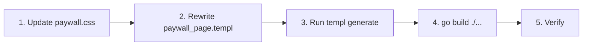

# Plan: Redesign `/paywall` Page to Match Reference Layout

## Objective

Adapt the `/paywall` page to follow the reference design structure (from wwiqtest.com) while preserving the project's existing Go + Gin + templ + Alpine.js architecture, design tokens, and Indonesian market context. All copy must be rephrased naturally in Indonesian. Payment methods use local Indonesian gateway Midtrans with QRIS as the primary option.

---

## 1. Structural Comparison

### Reference Structure (wwiqtest.com)
```
┌── thankyou-sec ──────────────────────────────────┐
│  ┌── Completion Banner (desktop/mobile) ─────┐  │
│  │  "You completed the test in 00:28 minutes" │  │
│  │  "Highly competent in Numerical Pattern"   │  │
│  └────────────────────────────────────────────┘  │
│  ┌── Well-done Content ──────────────────────┐  │
│  │  "Get your results, printable IQ cert..." │  │
│  └────────────────────────────────────────────┘  │
│  ┌── Order Details (heading + 3 items) ──────┐  │
│  │  1. IQ Evaluation Score (score image)      │  │
│  2. Printable IQ Certificate (cert image)  │  │
│  3. IQ Booster Program (brain image)       │  │
│  └────────────────────────────────────────────┘  │
│  ┌── Order Total ────────────────────────────┐  │
│  │  Total today: $4.99                        │  │
│  └────────────────────────────────────────────┘  │
│  ┌── Payment Methods ────────────────────────┐  │
│  │  [Card icons] [PayPal]                     │  │
│  └────────────────────────────────────────────┘  │
│  ┌── Checkbox + CTA ────────────────────────┐  │
│  │  ☐ I agree to Terms & Privacy             │  │
│  │  [Continue to Payment]                     │  │
│  └────────────────────────────────────────────┘  │
│  ┌── Disclaimer ─────────────────────────────┐  │
│  │  Full payment terms text                   │  │
│  └────────────────────────────────────────────┘  │
│  ┌── Customer Reviews ──────────────────────┐  │
│  │  Rating + Testimonials with stars          │  │
│  └────────────────────────────────────────────┘  │
│  ┌── Bottom CTA ────────────────────────────┐  │
│  │  [Continue to Payment]                     │  │
│  └────────────────────────────────────────────┘  │
└──────────────────────────────────────────────────┘
```

### Current Project Structure
```
┌── paywall-section ────────────────────────────┐
│  ┌── Completion Banner (compact tinted row) ─┐│
│  │  "Kamu menyelesaikan tes dalam X menit"   ││
│  └────────────────────────────────────────────┘│
│  ┌── Hero Header ───────────────────────────┐ │
│  │  "Selangkah Lagi, {Nama}" + badge Premium│ │
│  └────────────────────────────────────────────┘│
│  ┌── Score Preview (blurred) ───────────────┐ │
│  │  Total score + percentile + 4 domains    │ │
│  │  All blurred with lock icon              │ │
│  └────────────────────────────────────────────┘│
│  ┌── Value Props (3 items) ─────────────────┐ │
│  │  Checkmark list of what they unlock      │ │
│  └────────────────────────────────────────────┘│
│  ┌── Payment Card ──────────────────────────┐ │
│  │  Price + QRIS + Trust signal + Form      │ │
│  │  "Saya Sudah Bayar" button               │ │
│  └────────────────────────────────────────────┘│
│  ┌── FAQ (3 accordion items) ───────────────┐ │
│  └────────────────────────────────────────────┘│
│  ┌── Back Link ─────────────────────────────┐ │
│  └────────────────────────────────────────────┘│
└──────────────────────────────────────────────────┘
```

---

## 2. What Stays vs What Changes

### ✅ KEEP (Project Infrastructure)
| Item | Reason |
|------|--------|
| Go + Gin + templ + Alpine.js stack | Core architecture |
| `PaywallData` model (ID, Nama, DurationMinutes, DomainMessage) | No handler changes needed |
| `formatDurasi()` helper function | Already works correctly |
| `KonfirmasiBayar` JS function + fetch logic | Payment confirmation flow |
| `KonfirmasiBayar` POST handler | Backend verification |
| CSS design tokens from `style.css` (`--color-primary`, `--bg`, `--ink`, etc.) | Project identity |
| `paywall.css` file for paywall-specific CSS | Separation of concerns |
| Footer via `paywall_layout.templ` | Already wired |
| Max-width 640px inner container | Project convention |
| Indonesian language | Market context |
| QRIS payment (keep but restyle) | Indonesian payment method |

### 🔄 ADAPT FROM REFERENCE
| Element | Current | New (Adapted) |
|---------|---------|---------------|
| Completion Banner | Compact tinted row | Keep but restyle to match reference blue banner style |
| Hero / Well-done | "Selangkah Lagi, {Nama}" | Replace with reference-style "well-done content" paragraph about analysis |
| Score Display | Blurred progress bars | Replace with **Order Detail cards** (3 numbered items with images) |
| Value Props | 3 checkmark list items | Remove (integrated into order details) |
| Payment Section | Price + QRIS + Input + CTA | Restructure: Order total → Payment methods → Checkbox + CTA |
| Agreement | No checkbox | Add checkbox for Terms & Privacy acceptance |
| Reviews | Not present (but existing `TestimoniSection` component) | Add customer review section |
| FAQ Accordion | 3 items | **Remove** (not in reference) |
| Back Link | "Kembali ke Beranda" | **Remove** (not in reference) |
| Disclaimer | No full disclaimer | Add reference-style disclaimer text at bottom |

### 🆕 NEW ELEMENTS TO ADD
- Order Details heading + 3 numbered items with placeholder images
- Order Total row
- Payment method logos (card + e-wallet icons)
- Agreement checkbox with terms link
- Disclaimer text block
- Bottom CTA button
- Customer Reviews section

---

## 3. Detailed Section-by-Section Plan

### 3.1 Completion Banner
**File:** [`templ/pages/paywall_page.templ`](templ/pages/paywall_page.templ)

- Keep the `PaywallData`-driven content (duration + domain message)
- Restyle to match reference's `ty-top-blue` style — a blue/tinted banner
- Two variants: desktop (d-block d-sm-none wrapper) and mobile (d-none d-sm-block wrapper) — or use responsive CSS instead
- **Rephrased copy:** "Kamu menyelesaikan tes dalam **{durasi}**" + "Berdasarkan hasilmu, kamu menunjukkan kemampuan yang kuat di **{domain}**"

### 3.2 Well-done / Intro Content
- Replace current hero heading with text explaining what happens next
- **Rephrased copy:** "Hasil IQ-mu sudah dianalisis dan dibandingkan dengan peserta lain di Indonesia. Dapatkan hasil lengkap, sertifikat IQ cetak, dan akses program IQ Booster."

### 3.3 Order Details (NEW — replaces Score Preview + Value Props)
Three numbered order items:
1. **Skor IQ** — "Skor IQ Lengkap" + description + placeholder image (question mark)
2. **Sertifikat IQ** — "Sertifikat IQ Printable" + description + certificate image placeholder
3. **Program IQ Booster** — "Program IQ Booster" + 7-day trial description + brain image placeholder

Layout per item: number → info text → image (desktop side-by-side, mobile stacked)

### 3.4 Pricing & Payment
- Show "Total hari ini:" + price (**Rp9.900**) — updated from Rp14.900
- **QRIS as primary payment method** — large prominent box with placeholder QR code image
- **Bank & E-wallet logos as secondary row** — show icons/logos for:
  - Bank Transfer: BCA, Mandiri, BNI, BRI
  - E-wallet: GoPay, Dana, OVO, LinkAja
  - (Logos displayed as image strip, not interactive buttons — just showing available methods)
- **NEW:** Checkbox agreement — "Saya menyetujui [Syarat & Ketentuan] dan [Kebijakan Privasi]"
- **NEW:** Error message for un-checked checkbox (like reference)
- Keep `KonfirmasiBayar` JS logic but update button text and add checkbox validation
- **Rephrased button:** "Lanjutkan ke Pembayaran"

### 3.5 Disclaimer Text (NEW)
- Full terms text at bottom (adapted from reference)
- **Rephrased:** Informasi tentang trial 7 hari, auto-renew, harga, cara cancel

### 3.6 Customer Reviews (NEW)
- Import/reuse existing [`TestimoniSection`](templ/components/testimoni_section.templ) component
- OR build inline review section matching reference style (star ratings, names, text)
- Include average rating display

### 3.7 Bottom CTA (NEW)
- Duplicate "Lanjutkan ke Pembayaran" button at bottom

---

## 4. CSS Changes

**File:** [`assets/css/paywall.css`](assets/css/paywall.css)

### New classes needed:
| Class | Purpose |
|-------|---------|
| `.paywall-order-details` | Container for 3 order items |
| `.paywall-order-item` | Individual order item row |
| `.paywall-order-number` | Number badge (1, 2, 3) |
| `.paywall-order-image` | Image container for each item |
| `.paywall-order-total` | Total price row |
| `.paywall-agreement` | Checkbox + label styling |
| `.paywall-disclaimer` | Disclaimer text block |
| `.paywall-reviews` | Customer reviews container |
| `.paywall-review-card` | Individual review card |

### Modified existing classes:
- `.paywall-completion-banner` — restyle to reference blue banner style
- `.paywall-cta` — update to match reference orange button style
- `.paywall-payment-card` — restructure for new layout

---

## 5. Files to Modify

| File | Change |
|------|--------|
| [`templ/pages/paywall_page.templ`](templ/pages/paywall_page.templ) | Major restructure — replace sections 2-7 with order details + reviews + new payment layout |
| [`assets/css/paywall.css`](assets/css/paywall.css) | Add new classes, update existing ones (no token changes in style.css) |

### DO NOT MODIFY:
- `handlers/quiz.go` — handler logic unchanged
- `models/user.go` — PaywallData struct unchanged
- `services/quiz.go` — GetPaywallData unchanged
- `assets/css/style.css` — design tokens are sufficient
- `templ/pages/paywall_page_templ.go` — generated file, run `templ generate`
- JS `konfirmasiBayar` function logic (only add checkbox validation wrapper)

---

## 6. Execution Order



1. **Update [`assets/css/paywall.css`](assets/css/paywall.css)** — Add new classes for order details, agreement checkbox, disclaimer, reviews
2. **Rewrite [`templ/pages/paywall_page.templ`](templ/pages/paywall_page.templ)** — Restructure to match reference layout with Indonesian rephrased copy
3. **Run `templ generate`** — Regenerate `*_templ.go` files
4. **Run `go build ./...`** — Verify compilation
5. **Verify** — Check the page renders correctly

---

## 7. Copywriting — Rephrased Indonesian Text

| Reference EN | Rephrased ID |
|-------------|-------------|
| "You completed the test in 00:28 minutes" | "Kamu menyelesaikan tes dalam **{durasi}**" |
| "It seems that you are highly competent in Numerical Pattern Reasoning" | "Hasil menunjukkan kamu memiliki keunggulan di **{domain}**" |
| "Your IQ test was analyzed and compared to other participants' results in your country" | "Skor IQ-mu telah dianalisis dan dibandingkan dengan ribuan peserta lain di Indonesia" |
| "Get your results, a printable IQ certificate, and a 7-day trial..." | "Dapatkan hasil lengkap, sertifikat IQ eksklusif, dan akses program pengembangan otak" |
| "IQ Evaluation Score" | "Skor IQ Lengkap" |
| "Your overall World Wide IQ score" | "Skor IQ akurat berdasarkan jawabanmu" |
| "Printable World Wide IQ Certificate" | "Sertifikat IQ Eksklusif" |
| "Your very own World Wide IQ Certificate (High Quality Downloadable PDF)" | "Sertifikat IQ pribadi dalam format PDF berkualitas tinggi" |
| "IQ Booster Program" | "Program IQ Booster" |
| "7-day trial to IQ Booster – a brain training program..." | "Coba gratis 7 hari program pelatihan otak untuk mengasah kemampuan kognitifmu" |
| "Total today:" | "Total hari ini:" |
| "Continue to Payment" | "Lanjutkan ke Pembayaran" |
| "I understand that after the 7-day trial..." | "Saya memahami bahwa setelah masa trial 7 hari, langganan akan berlanjut otomatis..." |
| Disclaimer text | Informasi lengkap tentang pembayaran, trial, dan cara berlangganan |
